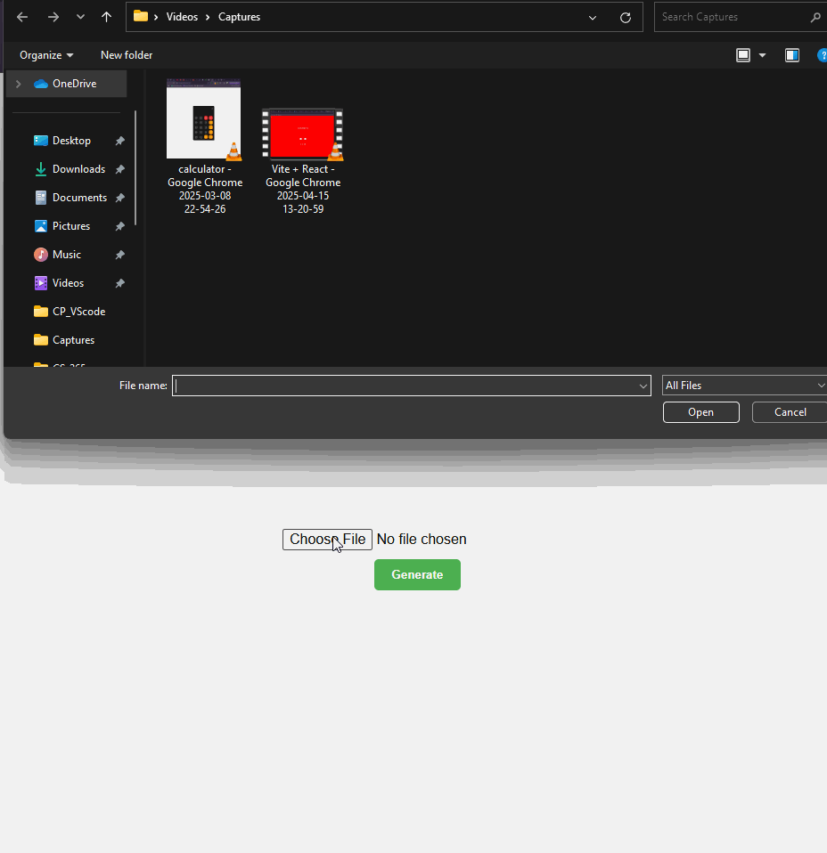

# 🌩️ CloudShare

CloudShare is a full-stack file-sharing web app that allows users to upload files, generate shareable links, and manage uploads using Cloudinary and MongoDB.

## 🚀 Features

- 📤 Upload any file type (images, documents, zips, etc.)
- 🔗 Generate a shareable Cloudinary link
- 🗂️ Store file metadata in MongoDB
- 📝 Update file title and description
- ❌ Delete files from Cloudinary and database
- ⚡ Real-time UI with loading states and link preview

## 🛠️ Tech Stack

- **Frontend**: React, CSS
- **Backend**: Express.js, Node.js
- **Database**: MongoDB with Mongoose
- **File Storage**: Cloudinary via `multer-storage-cloudinary`

## 📁 Project demo

